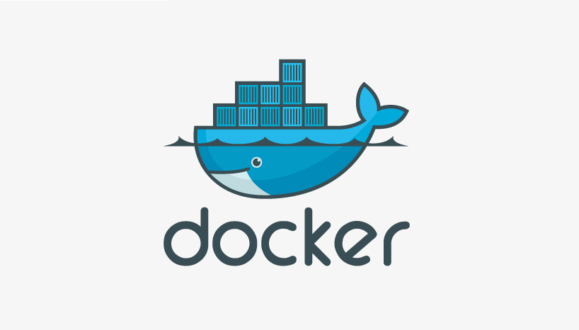

# Docker
# Сеть в Docker:
Создать сеть:
```bash
docker network create -d bridge phraseservice-network
```
Удалить сеть:
```bash
docker network rm phraseservice-network
```

# Backend:
## Создание образа:
linux:
```bash
docker build -t \
	fillswim/phraseservice-backend:latest \
	-f ./PhraseService/Docker/Backend/DockerfileBackend .
```
windows:
```bash
docker build -t `
	fillswim/phraseservice-backend:latest `
	-f ./PhraseService/Docker/Backend/DockerfileBackend .
```

#### Проверка работы образа (без сети Docker):
Запуск образа
```bash
docker run -it -p 1234:3000 fillswim/phraseservice-backend:latest
```
Проверка работы:
```bash
curl http://127.0.0.1:1234/
```
## Запуск образа в сети Docker:
linux:
```bash
docker run -d \
	--name=phraseservice-backend \
	--hostname=phraseservice-server \
	--network=phraseservice-network \
	fillswim/phraseservice-backend:latest
```
windows:
```bash
docker run -d `
	--name=phraseservice-backend `
	--hostname=phraseservice-server `
	--network=phraseservice-network `
	fillswim/phraseservice-backend:latest
```
## Удаление контейнера
```bash
 docker rm -f phraseservice-backend
```

# Frontend:
## Создание готового образа:
linux:
```bash
docker build -t \
	fillswim/phraseservice-frontend:latest \
	-f ./PhraseService/Docker/Frontend/DockerfileFrontend .
```
windows:
```bash
docker build -t `
	fillswim/phraseservice-frontend:latest `
	-f ./PhraseService/Docker/Frontend/DockerfileFrontend .
```
#### Запуск готового образа в сети Docker:
с использованием готового образа:
linux:
```bash
docker run -it -p 80:80 -d \
	--name=phraseservice-frontend \
	--hostname=phraseservice-client \
	--network=phraseservice-network \
	fillswim/phraseservice-frontend:latest
```
windows:
```bash
docker run -it -p 80:80 -d `
	--name=phraseservice-frontend `
	--hostname=phraseservice-client `
	--network=phraseservice-network `
	fillswim/phraseservice-frontend:latest
```

## Запуск образа Nginx c volumes:
#### c volumes:
linux:
```bash
docker run \
	--name=phraseservice-frontend \
	--hostname=phraseservice-client \
	--network=phraseservice-network \
	-d \
	-p 80:80 \
	-v "$(pwd)"/PhraseService/DockerCompose/conf:/etc/nginx:ro \
	-v "$(pwd)"/PhraseService/DockerCompose/www:/usr/share/nginx/html:ro \
	nginx:latest
```
windows:
docker: invalid reference format: repository name must be lowercase.
```bash
docker run `
	--name=phraseservice-frontend `
	--hostname=phraseservice-client `
	--network=phraseservice-network `
	-d `
	-p 80:80 `
	-v ${pwd}/phraseservice/dockercompose/conf:/etc/nginx:ro `
	-v ${pwd}/phraseservice/dockercompose/www:/usr/share/nginx/html:ro `
	nginx:latest
```
#### c mount:
linux:
```bash
docker run \
	--name=phraseservice-frontend \
	--hostname=phraseservice-client \
	--network=phraseservice-network \
	-d \
	-p 80:80 \
	--mount type=bind,source="$(pwd)"/PhraseService/DockerCompose/conf,target=/etc/nginx,readonly \
	--mount type=bind,source="$(pwd)"/PhraseService/DockerCompose/www,target=/usr/share/nginx/html,readonly \
	nginx:latest
```
windows:
```bash
docker run `
	--name=phraseservice-frontend `
	--hostname=phraseservice-client `
	--network=phraseservice-network `
	-d `
	-p 80:80 `
	--mount type=bind,source=E:/OpenShiftTemplates/phraseservice/dockercompose/conf,target=/etc/nginx,readonly `
	--mount type=bind,source=E:/OpenShiftTemplates/phraseservice/dockercompose/www,target=/usr/share/nginx/html,readonly `
	nginx:latest
```
## Удаление контейнера
```bash
 docker rm -f phraseservice-frontend
```
## Проверка работы Frontend - образа:
```bash
curl http://127.0.0.1:80/
```
