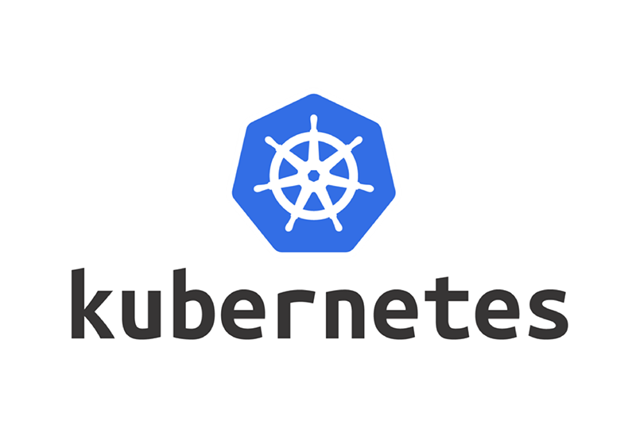

# Kubernetes
# Развертывание в K8s
## <u>ConfigMap</u>
Создание yaml файла для создания configMap для HTML из папки:
```bash
kubectl create configmap frontend-config-html \
	--from-file=./PhraseService/K8s/frontend-config/html \
	--dry-run=client -o yaml | sed '/creationTimestamp/d' \
> ./PhraseService/K8s/frontend-config/frontend-configmap-html.yaml
```
Создание yaml файла для создания configMap для NGINX из папки:
```bash
kubectl create configmap frontend-config-nginx \
	--from-file=./PhraseService/K8s/frontend-config/nginx \
	--dry-run=client -o yaml | sed '/creationTimestamp/d' \
> ./PhraseService/K8s/frontend-config/frontend-configmap-nginx.yaml
```
Применение созданного yaml файла с configMap для HTML
```bash
kubectl apply \
	-f ./PhraseService/K8s/frontend-config/frontend-configmap-html.yaml
```
Применение созданного yaml файла с configMap для NGINX
```bash
kubectl apply \
	-f ./PhraseService/K8s/frontend-config/frontend-configmap-nginx.yaml
```
Просмотр созданных configMap:
```shell
kubectl get configmap
```
Удаление configMap для HTML:
```shell
kubectl delete configmap frontend-config-html
```
Удаление configMap для NGINX:
```shell
kubectl delete configmap frontend-config-nginx
```
## <u>Backend</u>
### Deployment
Создание Deployment:
```bash
kubectl apply \
	-f PhraseService/K8s/Quote-01-Deployment-Backend.yaml
```
Удаление Deployment:
```bash
kubectl delete \
	-f PhraseService/K8s/Quote-01-Deployment-Backend.yaml
```
Просмотр подов:
```bash
kubectl get pods
```
Проверка работоспособности пода:
```bash
kubectl \
	exec quote-backend-deployment-56f478b68d-66zn6 \
	-- curl -s 127.0.0.1:3000
```
### HPA
Создание HPA
```bash
kubectl apply \
	-f PhraseService/K8s/Quote-02-HPA-Backend.yaml
```
Удаление HPA:
```bash
kubectl delete \
	-f PhraseService/K8s/Quote-02-HPA-Backend.yaml
```
Просмотр HPA:
```bash
kubectl get hpa
```
### Service
Создание Service:
```bash
kubectl apply \
	-f PhraseService/K8s/Quote-03-Service-Backend.yaml
```
Удаление Service:
```bash
kubectl delete \
	-f PhraseService/K8s/Quote-03-Service-Backend.yaml
```
Просмотр созданных сервисов:
```bash
kubectl get services
```
Проверка работы сервиса:
```bash
curl --head http://10.233.6.155:3000/
```
или
```bash
curl http://10.233.6.155:3000/
```
## <u>Frontend</u>
### Deployment
Создание Deployment:
```bash
kubectl apply \
	-f PhraseService/K8s/Quote-04-Deployment-Frontend-ConfigMap.yaml
```
Удаление Deployment:
```bash
kubectl delete \
	-f PhraseService/K8s/Quote-04-Deployment-Frontend-ConfigMap.yaml
```
Просмотр подов:
```bash
kubectl get pods
```
Проверка работоспособности пода:
```bash
kubectl \
	exec quote-frontend-deployment-56cbb699d9-btchz \
	-- curl -s 127.0.0.1:8080
```
### HPA
Создание HPA
```bash
kubectl apply \
	-f PhraseService/K8s/Quote-05-HPA-Frontend.yaml
```
Удаление HPA
```bash
kubectl delete \
	-f PhraseService/K8s/Quote-05-HPA-Frontend.yaml
```
### Service
Создание сервиса:
```bash
kubectl apply \
	-f PhraseService/K8s/Quote-06-Service-Frontend.yaml
```
Удаление сервиса:
```bash
kubectl delete \
	-f PhraseService/K8s/Quote-06-Service-Frontend.yaml
```
Просмотр созданных сервисов:
```bash
kubectl get services
```
Вывод:
```
NAME                     TYPE        CLUSTER-IP      EXTERNAL-IP   PORT(S)    AGE
phraseservice-server     ClusterIP   10.233.36.32    <none>        3000/TCP   17m
quote-frontend-service   ClusterIP   10.233.32.181   <none>        80/TCP     82s
```
Проверка работы сервиса:
```bash
curl --head http://10.233.56.66:80/
```

```bash
curl http://10.233.56.66:80/
```
## <u>Ingress</u>
Создание Ingress Roles:
```bash
kubectl apply \
	-f PhraseService/K8s/Quote-07-Ingress.yaml
```
Удаление Ingress Roles:
```bash
kubectl delete \
	-f PhraseService/K8s/Quote-07-Ingress.yaml
```
Просмотр созданных Ingress Roles:
```bash
kubectl get ingress
```
Проверка работы сайта:
```bash
curl https://site.fillswim.com
```
[site.fillswim.com](https://site.fillswim.com/)
